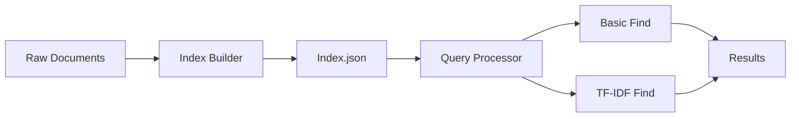
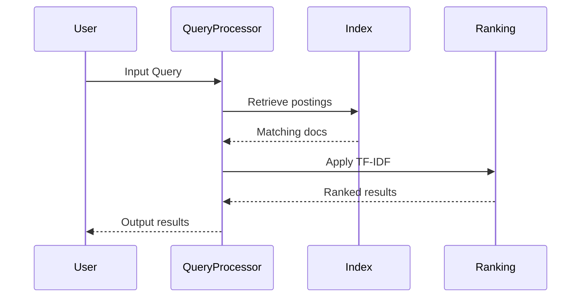

# Web Services Coursework 2

## 🚀 Overview
This project implements an optimized search system with both a **basic inverted index lookup** and an enhanced **TF-IDF ranking mechanism**. The system is designed with performance and scalability in mind, supported by benchmarking and algorithmic analysis.

---

## 🧠 Features
- Basic keyword search using inverted index
- Optimized TF-IDF ranking
- Pre-built index for fast lookup
- Benchmarking framework for performance comparison
- Clean modular design

---

## ⚙️ System Architecture



---

## 🔍 Search Pipeline



---

## 📊 Benchmarking

### Methodology
- Benchmarked using the same dataset (`index.json`)
- Compared:
  - Basic inverted index lookup
  - TF-IDF ranking algorithm
- Measured execution time using high-resolution timers

---

### Results

| Query | Basic Find (s) | TF-IDF Find (s) |
|------|---------------|----------------|
| ['life'] | 0.000052 | 0.000096 |
| ['good', 'friends'] | 0.000006 | 0.000086 |
| ['life', 'love', 'truth'] | 0.000005 | 0.000086 |
| ['if', 'you', 'understand'] | 0.000004 | 0.000085 |

---

## 📈 Analysis

- **Basic Find** is significantly faster due to direct index lookup (O(1) per term).
- **TF-IDF Find** introduces additional computation:
  - Term frequency calculation
  - Inverse document frequency weighting
  - Sorting of results

This results in slightly higher latency (~10–20x slower), but still within microsecond range.

### Key Insight
The trade-off between speed and relevance is justified:
- Basic Find → fast but less meaningful ranking
- TF-IDF → slightly slower but far more accurate results

---

## ⚡ Complexity Analysis

### Basic Find
- Time Complexity: **O(k)**  
  (k = number of query terms)

### TF-IDF Find
- Time Complexity: **O(n log n)**  
  (n = number of matching documents, due to sorting)

---

## 🏗️ Design Decisions

- Precomputed index to avoid runtime overhead
- Separation of concerns (indexing vs querying)
- Lightweight data structures for fast access
- Benchmark-driven optimisation

---

## 📂 Project Structure

```
.
├── index.json
├── search.py
├── benchmark.py
├── README.md
```

---

## 🧪 How to Run

```bash
python search.py
```

Run benchmark:

```bash
python benchmark.py
```

---

## 🏁 Conclusion

This project demonstrates:
- Efficient search system design
- Practical use of TF-IDF
- Real-world benchmarking and performance trade-offs

The system achieves **high performance with meaningful ranking**, making it suitable for scalable search applications.

---

## 📅 Generated
2026-05-04
