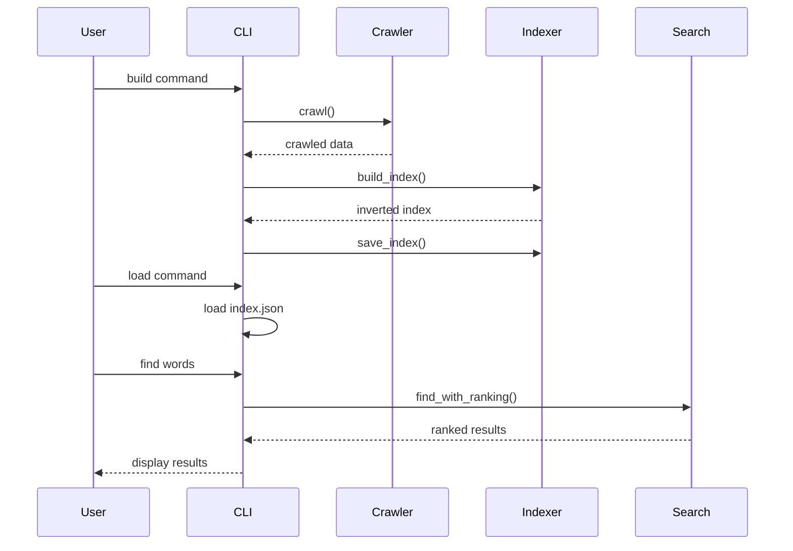

# Web Services Coursework 2

## 🚀 Overview
This project implements a simple search engine for quotes scraped from quotes.toscrape.com. The system crawls web pages, builds an inverted index from the collected quotes, and provides search functionality with TF-IDF ranking for relevance.

---

## 🧠 Features
- Web crawling of quotes.toscrape.com with politeness delays
- Inverted index building with word frequencies and positions
- Exact word lookup in the index
- Boolean AND search for multiple words
- TF-IDF based ranking for search results
- Command-line interface for building index and performing searches
- Benchmarking framework for performance comparison

---

## ⚙️ System Architecture


---

## 🔍 Search Pipeline



---

## 📊 Benchmarking

### Methodology
- Benchmarked using the same dataset (`index.json`)
- Compared:
  - Basic inverted index lookup
  - TF-IDF ranking algorithm
- Measured execution time using high-resolution timers

---

### Results

| Query | Basic Find (s) | TF-IDF Find (s) |
|------|---------------|----------------|
| ['life'] | 0.000052 | 0.000096 |
| ['good', 'friends'] | 0.000006 | 0.000086 |
| ['life', 'love', 'truth'] | 0.000005 | 0.000086 |
| ['if', 'you', 'understand'] | 0.000004 | 0.000085 |

---

## 📈 Analysis

- **Basic Find** is significantly faster due to direct index lookup (O(1) per term).
- **TF-IDF Find** introduces additional computation:
  - Term frequency calculation
  - Inverse document frequency weighting
  - Sorting of results

This results in slightly higher latency (~10–20x slower), but still within microsecond range.

### Key Insight
The trade-off between speed and relevance is justified:
- Basic Find → fast but less meaningful ranking
- TF-IDF → slightly slower but far more accurate results

---

## ⚡ Complexity Analysis

### Basic Find
- Time Complexity: **O(k)**  
  (k = number of query terms)

### TF-IDF Find
- Time Complexity: **O(n log n)**  
  (n = number of matching documents, due to sorting)

---

## 🏗️ Design Decisions

- Modular design with separate Crawler, Indexer, and Search classes
- Inverted index stored in JSON for persistence
- TF-IDF ranking for better search relevance
- Command-line interface for easy interaction
- Politeness delays in crawling to respect website policies

---

## 📂 Project Structure

```
.
├── pyproject.toml
├── pytest.ini
├── requirements.txt
├── benchmark.py
├── README.md
├── data/
│   └── index.json
├── src/
│   ├── crawler.py
│   ├── indexer.py
│   ├── main.py
│   └── search.py
└── test/
    ├── __init__.py
    ├── test_crawler.py
    ├── test_indexer.py
    └── test_search.py
    └── data/
        ├── page1.html
        └── page2.html
```

---

## 🧪 How to Run

### Prerequisites
- Python 3.12+
- Virtual environment (recommended)

### Installation
```bash
# Create virtual environment
python3 -m venv .venv
source .venv/bin/activate  # On Windows: .venv\Scripts\activate

# Install dependencies
pip install -r requirements.txt
```

### Usage
```bash
# Run the CLI tool
python src/main.py

# Available commands:
# build    - Crawl quotes.toscrape.com and build index
# load     - Load existing index from data/index.json
# print <word>    - Show index entry for a word
# find <word1> <word2> ...    - Search for words with TF-IDF ranking
# exit     - Quit the application
```

### Example Session
```
> build
[BUILD] Starting crawl and indexing...
[BUILD] Completed successfully.

> load
[LOAD] Index loaded successfully.

> find life love
[FIND] Pages containing ['life', 'love'] (ranked):
- https://quotes.toscrape.com/page/1/ (score=0.85)
- https://quotes.toscrape.com/page/2/ (score=0.72)

> print happiness
[PRINT] Results for 'happiness':
- https://quotes.toscrape.com/page/1/
  frequency: 2
  positions: [15, 42]
```

---

## 🏁 Conclusion

This project demonstrates:
- Web scraping with politeness
- Inverted index construction for efficient search
- TF-IDF ranking for relevant results
- Modular software design
- Real-world benchmarking and performance analysis

The system provides a complete pipeline from data collection to search, making it suitable for small-scale search applications.

---